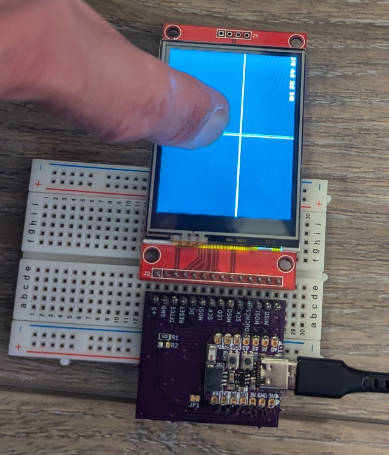

# CircuitPython tester for ILI9341 320x200 2.4" touch screen

These are the ubiquitious units available from Chinese sellers always on a red PCB and having an SD card slot.  The purpose here is to allow basic testing of these boards, and perhaps to serve as a minimal example program.

## Tester PCB

The KiCad project is in the `pcb` subdirectory.  Or you can use this shared project on OSH Park: https://oshpark.com/shared_projects/n6qEPelo

Bill of materials:
* [Adafruit QT Py ESP32-S2](https://www.adafruit.com/product/5325)
* 0805 footprint 62 ohm resistor for R1.  I think some boards connect the "LED" wire directly to the
backlight and others need a digital signal.  In any case, a 62 ohm resistor should work for all cases.  In case you need to dissipate more power you can place both R1 and R2, which are wired in parallel.
* 14 pin header.  The easiest way to use it is to plug the tester and the display both into a
breadboard.

## Firmware

Just copy `code.py` and `lib` over to your CircuitPython device.

## Usage

Touch the screen and you should see the crosshairs move.  Don't worry if they don't match the touch location or even if they are reversed.  All that matters is that they move when you move your finger, and hopefully aren't too shaky.  In practice, you are expected to do a four-point calibration procedure to link the touch values to screen positions.

The raw touch values are printed at the top of the display.

You can hot-swap in a new display and press the "boot" button to re-initialize.  (You could also press "reset" but that reboots the whole system, which takes a few seconds.)

